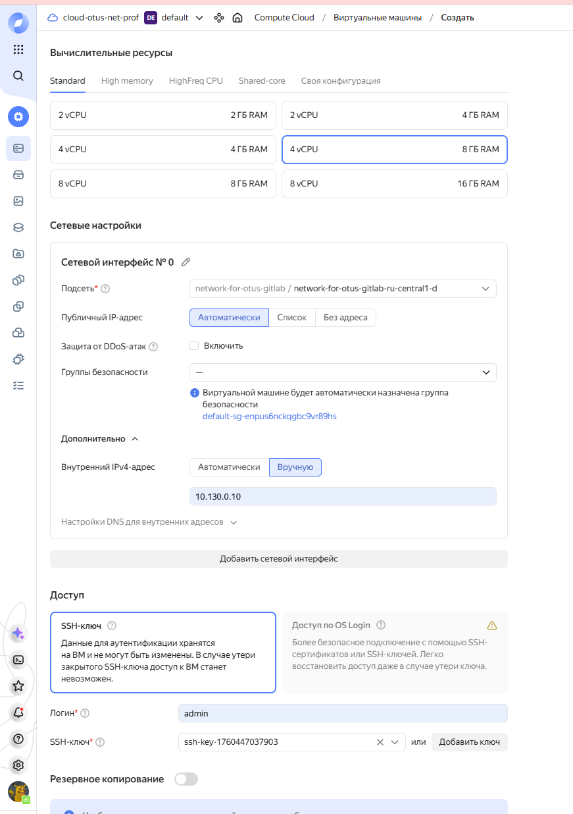
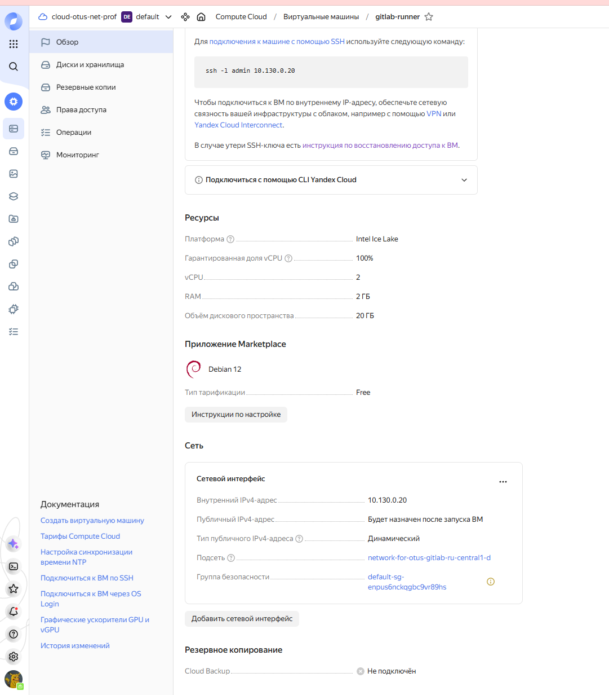
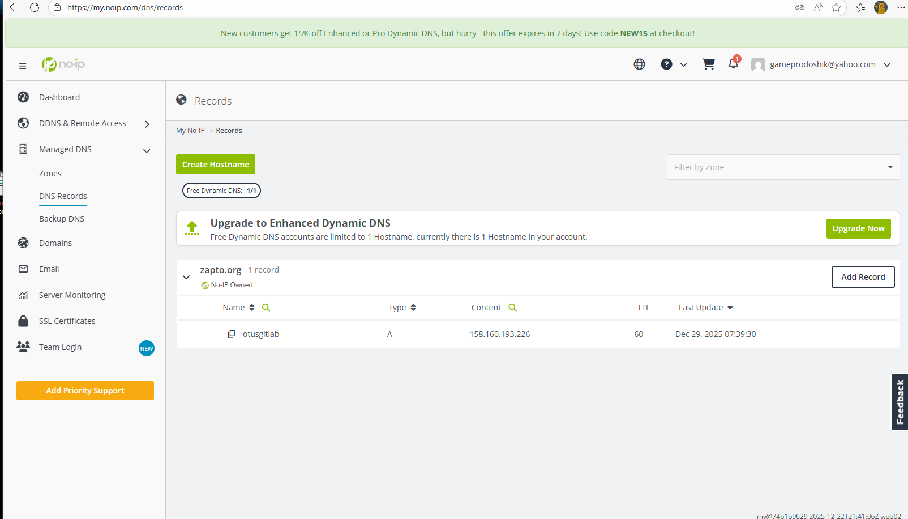
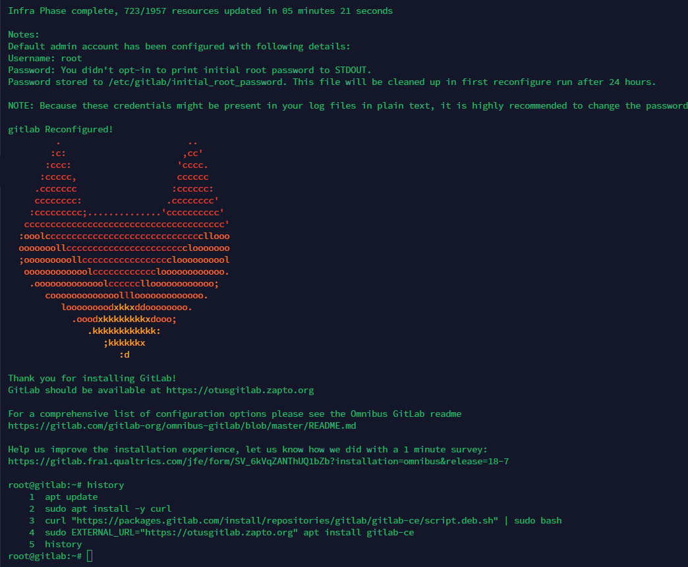
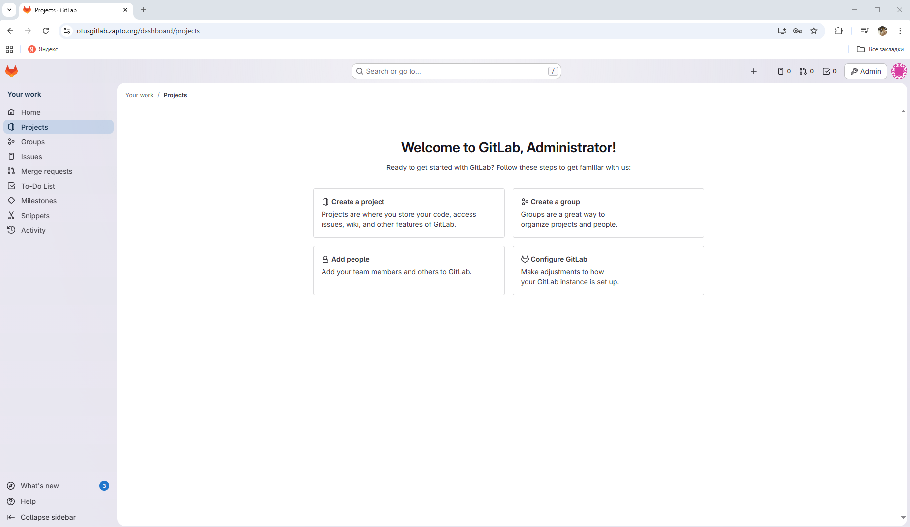

## Архитектура GitLab, GitLab Runner

### Цели:
1) Развернуть GitLab, тем способом, который вам удобен

2) Развернуть GitLab Runner, соблюдая следующие условия:

GitLab Runner должен быть привязан к инстансу или к группе.
GitLab Runner должен быть развёрнуть не в Docker.
GitLab Runner должен использовать Docker Executor.
По умолчанию, GitLab Runner должен использовать image alpine версии 3.

**Шаг 1. Установка компонентов Gitlab**

Для начала я создал 2 машины в Yandex Cloud (одна машина под gitlab server, вторая для развёртывания gitlab runner).

Обе виртуальные машины будут у меня в зоне d, дополнительно я создал сеть внтури облака (10.130.0.0/24) для взаимодействия между виртуалками.

Создание виртуальной машины для Gitlab server

Создание виртуальной машины для Gitlab runner server

Также для выпуска SSL сертификата на noip я зарегистрировал домен otusgitlab.zapto.org

После этого я приступил к установке Gitlab server на первую виртуальную машину.

