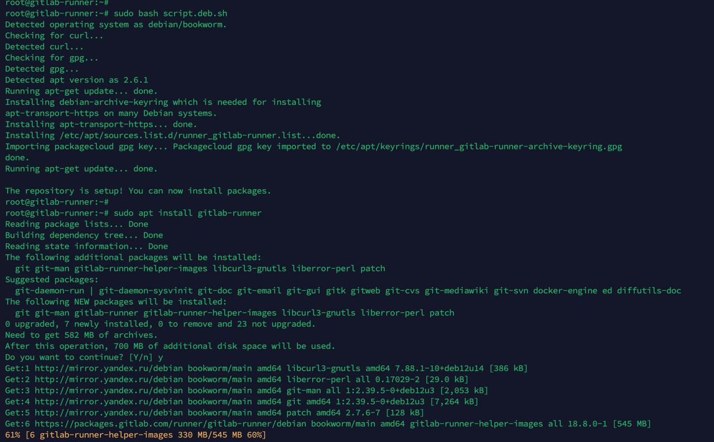
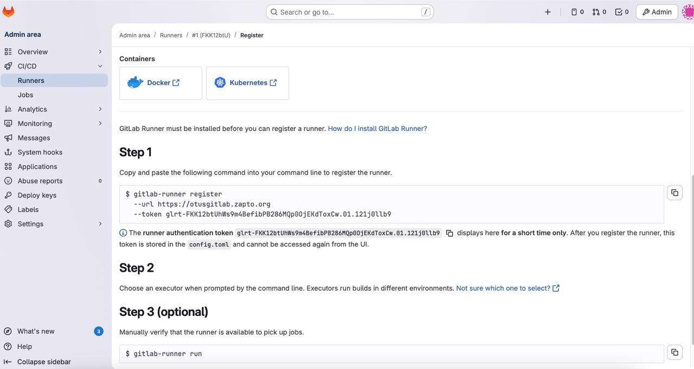
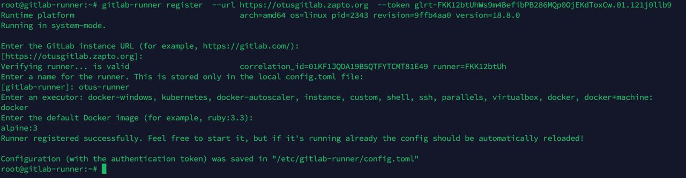
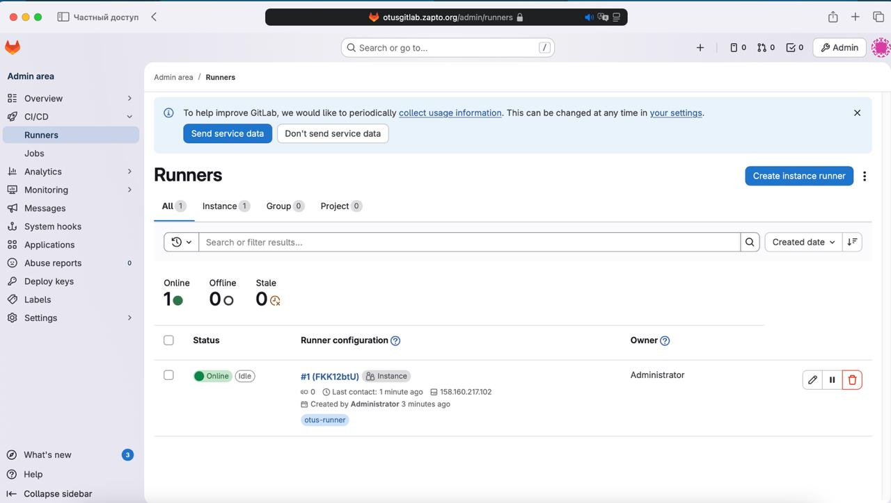

## Архитектура GitLab, GitLab Runner

### Цели:
1) Развернуть GitLab, тем способом, который вам удобен

2) Развернуть GitLab Runner, соблюдая следующие условия:

GitLab Runner должен быть привязан к инстансу или к группе.
GitLab Runner должен быть развёрнуть не в Docker.
GitLab Runner должен использовать Docker Executor.
По умолчанию, GitLab Runner должен использовать image alpine версии 3.


**Шаг 1. Установка компонентов Gitlab**

Для начала я создал 2 машины в Yandex Cloud (одна машина под gitlab server, вторая для развёртывания gitlab runner).

Обе виртуальные машины будут у меня в зоне d, дополнительно я создал сеть внтури облака (10.130.0.0/24) для взаимодействия между виртуалками.

Создание виртуальной машины для Gitlab server


Создание виртуальной машины для Gitlab runner server


Также для выпуска SSL сертификата на noip я зарегистрировал домен otusgitlab.zapto.org


После этого я приступил к установке Gitlab server на первую виртуальную машину.


Далее, по инструкции я установил пакет runner'a на ранее созданную виртуальную машину.



После этого, в Gitlab был создан новый runner и сгенерирована ссылка на подключение.



Далее, на runner'е я выполнил скопированную команду. В качестве Executor'a выбран Docker, базовый образ alpine версии 3.



Конфигурационный файл runner'a:

```
root@gitlab-runner:~# cat /etc/gitlab-runner/config.toml
concurrent = 1
check_interval = 0
connection_max_age = "15m0s"
shutdown_timeout = 0

[session_server]
  session_timeout = 1800

[[runners]]
  name = "otus-runner"
  url = "https://otusgitlab.zapto.org"
  id = 1
  token = "glrt-FKK12btUhWs9m4BefibPB286MQp0OjEKdToxCw.01.121j0llb9"
  token_obtained_at = 2026-01-15T19:39:40Z
  token_expires_at = 0001-01-01T00:00:00Z
  executor = "docker"
  [runners.cache]
    MaxUploadedArchiveSize = 0
    [runners.cache.s3]
    [runners.cache.gcs]
    [runners.cache.azure]
  [runners.docker]
    tls_verify = false
    image = "alpine:3"
    privileged = false
    disable_entrypoint_overwrite = false
    oom_kill_disable = false
    disable_cache = false
    volumes = ["/cache"]
    shm_size = 0
    network_mtu = 0
```

После всех действий, раннер успешно подключился к GitLab-серверу.

