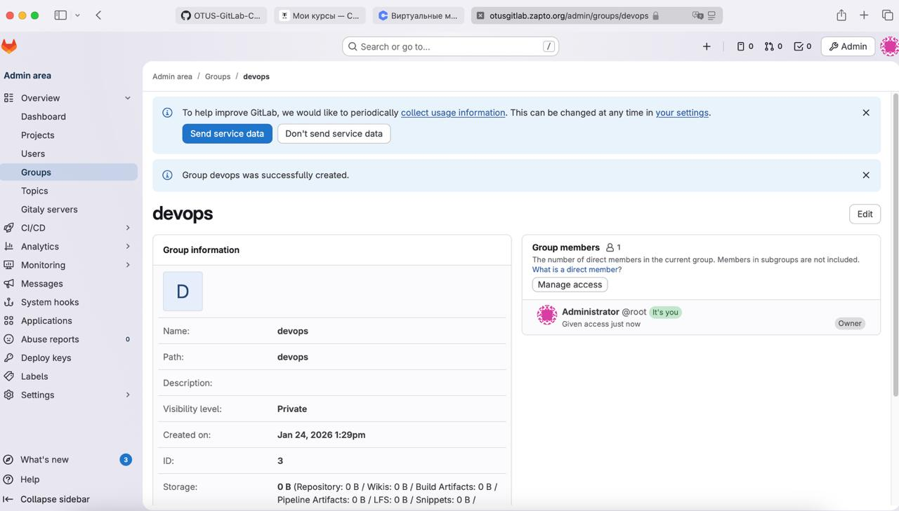
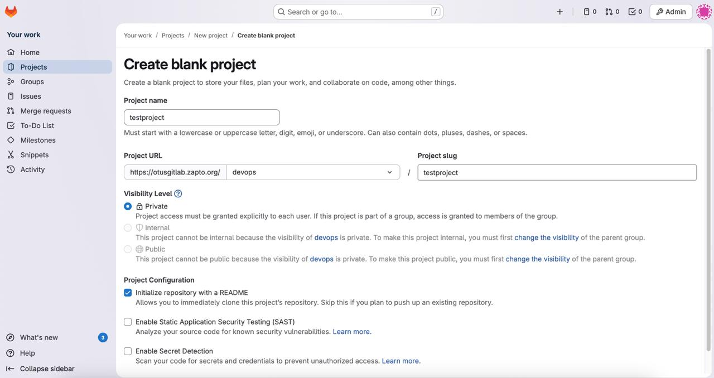
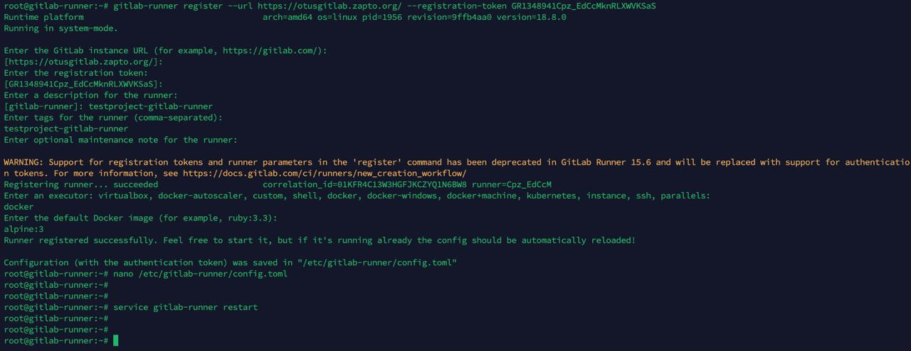
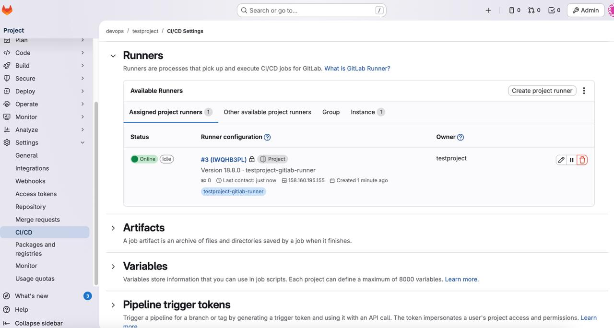
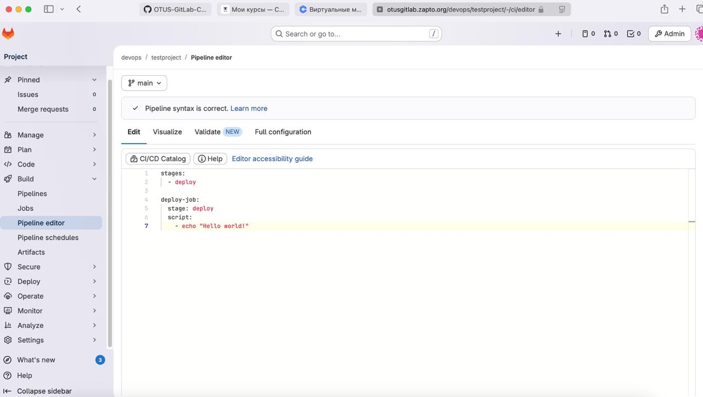
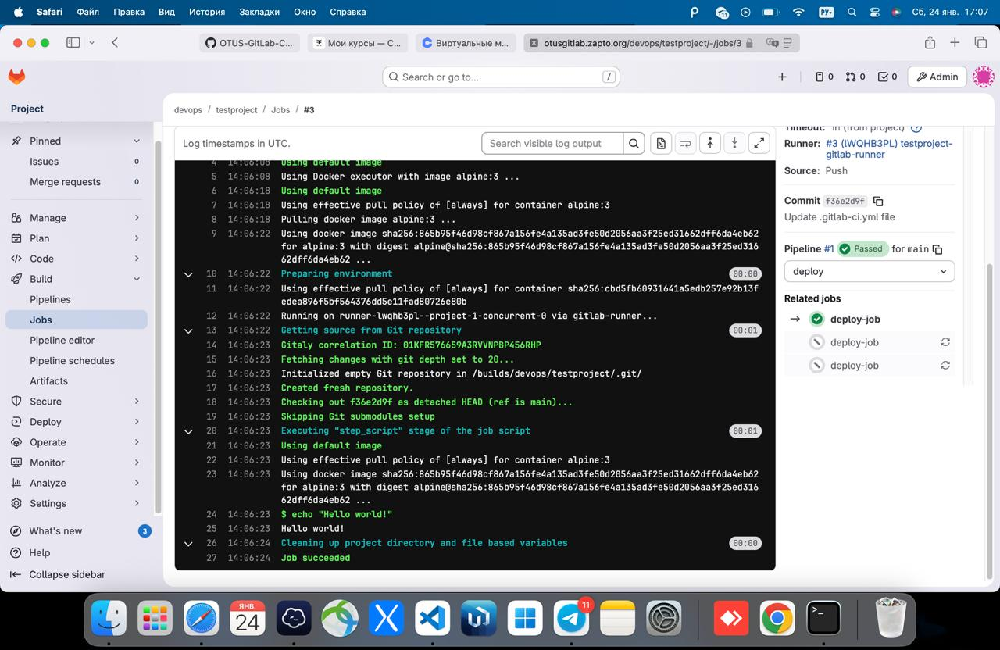

## Создание проекта и запуск проверочного пайплайна

### Цели:
1) Научиться создавать проект и запускать проверочный пайплайн.

**Ход работы**

Для начала, я создал новую группу пользователей, назвал её "devops" и добавил в неё своего пользователя.

Далее, я создал новый проект и поместил его в созданный ранее namespase группы.

После этого, в настройках проекта необходимо привязать раннер. На виртуальной машине с раннером я выполнил следующие команды, предварительно скопировав токен из Гитлаба:

Затем, в настройках CI/CD проекта появился новый раннер

Далее, я создал простой пайплайн, который состоит из 1 stages и одной джобы, которая выполняет команду "echo "Hello world!"

Далее, сохраняем изменения и запускаем пайплайн. Как показано на скриншоте ниже, всё выполнилось успешно.

