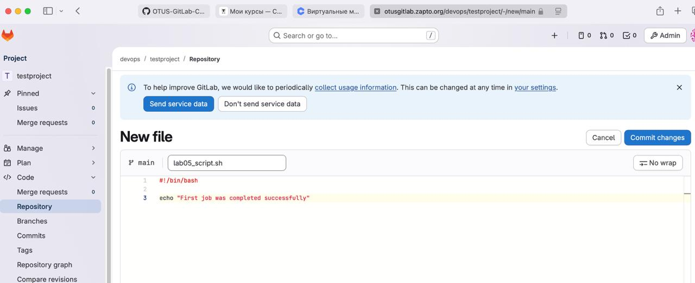
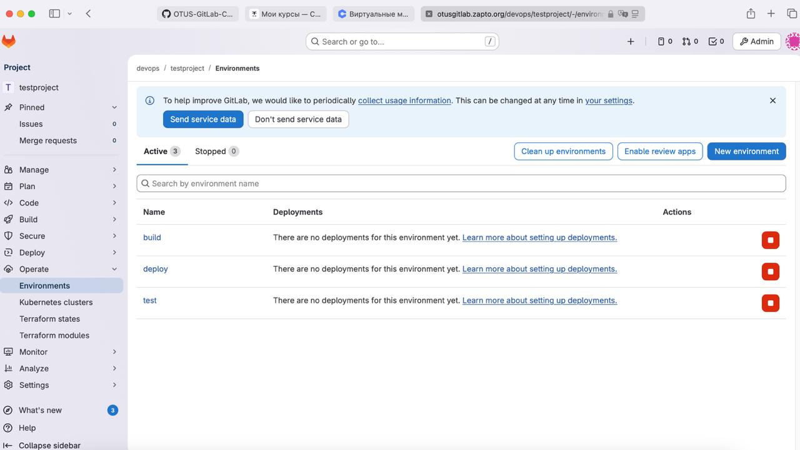
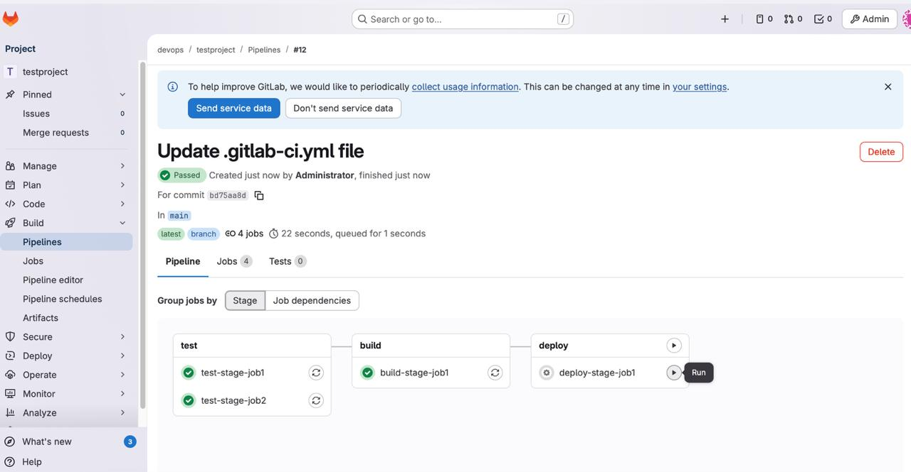
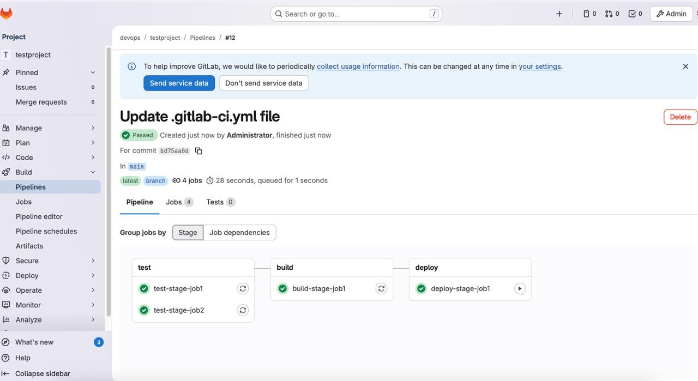
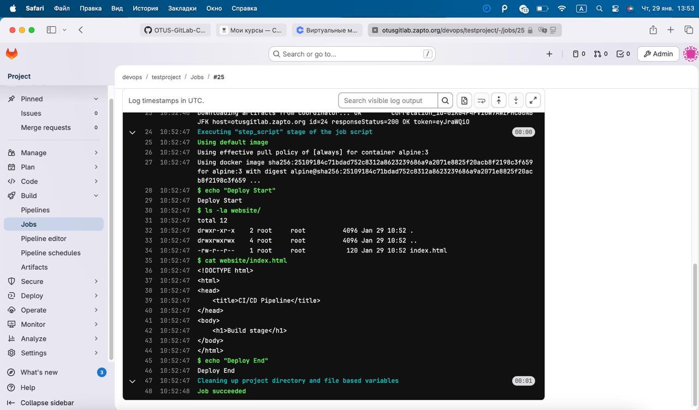

## Простой пайплайн

### Цели:
1) Напишите gitlab-ci состоящий из трех stages: test, build, deploy.
2) В test используя before_script создайте тестовые данные, в script запустите тесты, в after_script удалите ненужное.
3) В test сделайте вторую job, чтобы она запускала скрипт из репозитория, но только если первая job была успешна.
4) В build сделайте сборку, в deploy создайте несколько job на разные окружения;


**Ход работы**

Для начала, я написал простой скрипт для использования его в test-stage-job2



Далее, для каждого stage в переменных проекта я создал отдельные переменные, которые в дальнейшем использовал в gitlab-ci.yml.




Итоговый конфиг gitlab-ci.yml:

```
variables:
  DIR_NAME: "test_directory"

stages:         
  - test
  - build
  - deploy

test-stage-job1:      
  stage: test
  environment: 
    name: test
  before_script:
    - mkdir $DIR_NAME  
  script:
    - touch $DIR_NAME/test_file.txt
    - ls $DIR_NAME 
  after_script:
    - rm -rf $DIR_NAME  

test-stage-job2:      
  stage: test
  environment: 
    name: test
  before_script:
    - chmod +x lab05_script.sh
  script:
    - sh lab05_script.sh
  needs:
    - test-stage-job1

build-stage-job1:
  stage: build
  environment: 
    name: build
  needs:
    - test-stage-job2
  script:
    - echo "Сборка статического сайта"
    - mkdir -p website
    - |
      cat > website/index.html << 'EOF'
      <!DOCTYPE html>
      <html>
      <head>
          <title>CI/CD Pipeline</title>
      </head>
      <body>
          <h1>Build stage</h1>
      </body>
      </html>
      EOF
    - cat website/index.html
    
  artifacts:
    paths:
      - website/
    expire_in: 1 week

deploy-stage-job1:
  stage: deploy
  environment:
    name: production
  needs:
    - build-stage-job1
  script:
    - echo "Deploy Start"
    - ls -la website/
    - cat website/index.html
    - echo "Deploy End"
  when: manual
```

Этапы успешного прохождения всех этапов каждой джобы и ручное выполнение финальный джобы деплоя:



Успешное выполнение джобы деплоя:



