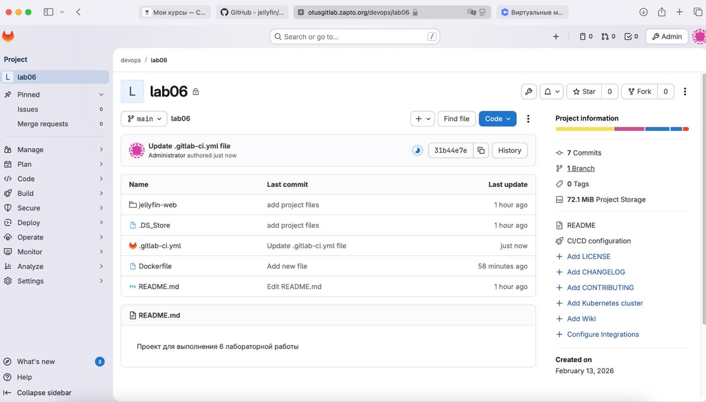
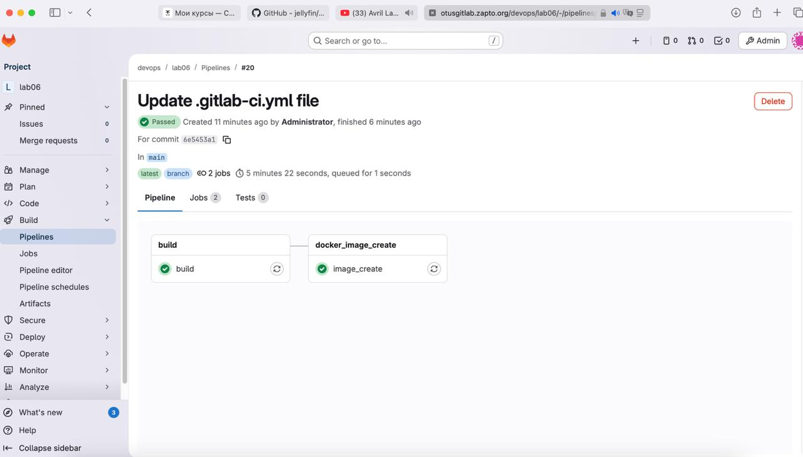
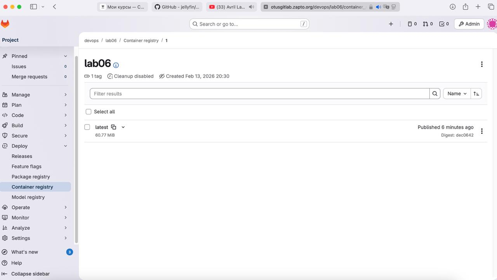

## Сборка настоящего проекта

### Цели:
1) Написать gitlab-ci к проекту. Ссылка на проект: https://github.com/jellyfin/jellyfin-web;


**Ход работы**

Для начала, я создал новый проект в Gitlab и склонировал в него указанный репозиторий на Гитхабе к себе в репозиторий, создал Dockerfile и gitlab-ci.yml с следующим содержимым



Dockerfile
```
FROM nginx:stable-alpine

COPY dist /usr/share/nginx/html

EXPOSE 80
CMD ["nginx", "-g", "daemon off;"]
```

gitlab-ci
```
stages:
  - build
  - docker_image_create

build:
  image: node:20-alpine
  stage: build

  script:
    - ls -la
    - cd jellyfin-web
    - ls -la
    - npm ci
    - npm run build:production
    - mv dist ../dist

  artifacts:
    paths:
      - dist
    expire_in: 2 hours
    
image_create:
  stage: docker_image_create
  
  image:
    name: gcr.io/kaniko-project/executor:debug
    entrypoint: [""]
  
  script:
    - mkdir -p /kaniko/.docker
    - echo "{\"auths\":{\"$CI_REGISTRY\":{\"username\":\"$CI_REGISTRY_USER\",\"password\":\"$CI_REGISTRY_PASSWORD\"}}}" > /kaniko/.docker/config.json
    - /kaniko/executor --context $CI_PROJECT_DIR --dockerfile $CI_PROJECT_DIR/Dockerfile --destination $CI_REGISTRY_IMAGE:latest
```

Успешное выполнение джоб и итоговый образ в registry



