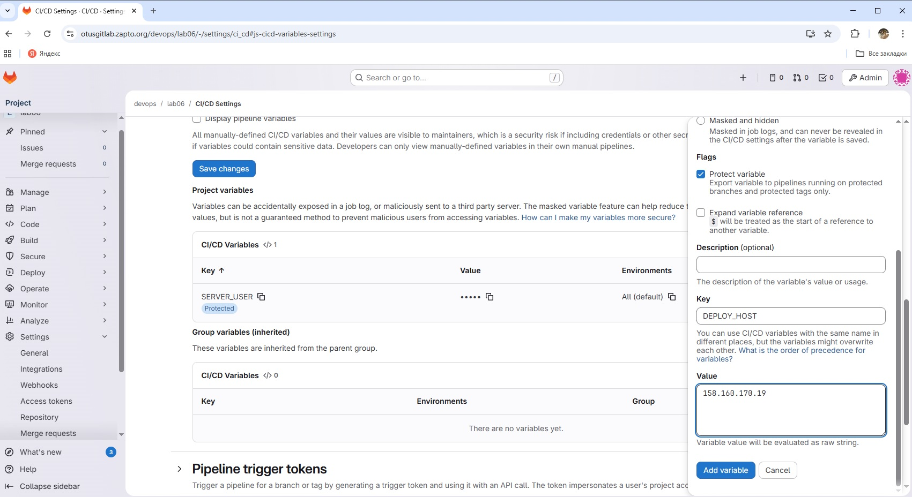
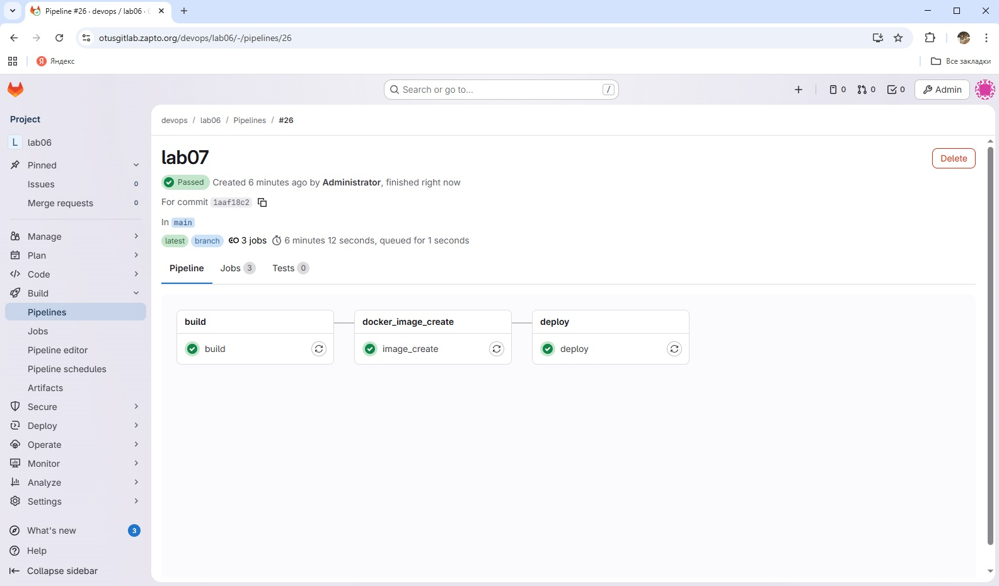
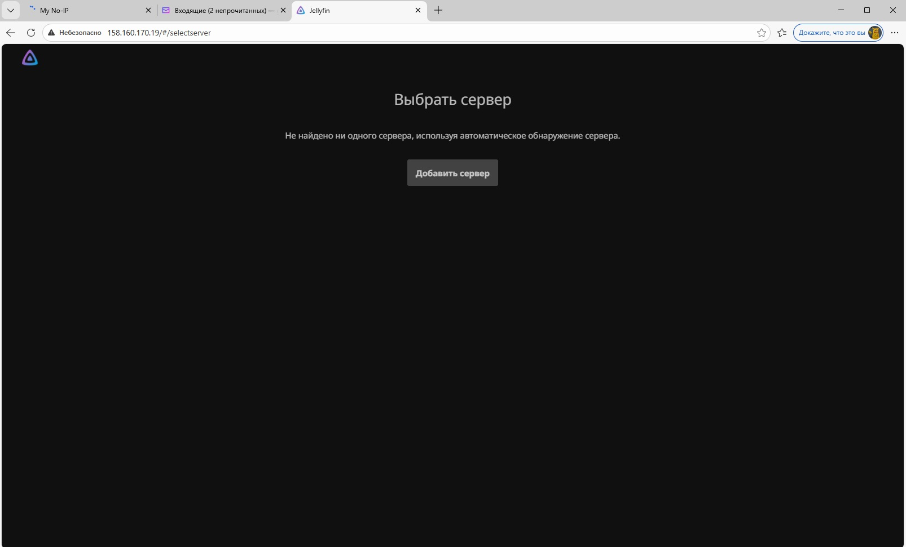

## CD c Docker, Docker Compose, Kubernetes
### Цели:
1) Написать CD собранного в предыдущем ДЗ приложения на сервер. Деплой должен происходить в Docker или Docker Compose;

2) Написать СD приложения, деплой должен происходить в Kubernetes. Ссылка на приложение: https://github.com/matheusfm/httpbin-chart;

  Для начала в настройках Ci/CD я создал новые переменные для указания конечного хоста, на который будет производить деплой, пользователя и SSH ключ.

  

  Далее я добавил stage deploy в gitlab-ci файл
  ```
  stages:
  - build
  - docker_image_create
  - deploy


build:
  image: node:20-alpine
  stage: build

  script:
    - ls -la
    - cd jellyfin-web
    - ls -la
    - npm ci
    - npm run build:production
    - mv dist ../dist

  artifacts:
    paths:
      - dist
    expire_in: 2 hours
    
image_create:
  stage: docker_image_create
  
  image:
    name: gcr.io/kaniko-project/executor:debug
    entrypoint: [""]
  
  script:
    - mkdir -p /kaniko/.docker
    - echo "{\"auths\":{\"$CI_REGISTRY\":{\"username\":\"$CI_REGISTRY_USER\",\"password\":\"$CI_REGISTRY_PASSWORD\"}}}" > /kaniko/.docker/config.json
    - /kaniko/executor --context $CI_PROJECT_DIR --dockerfile $CI_PROJECT_DIR/Dockerfile --destination $CI_REGISTRY_IMAGE:latest


deploy:
  stage: deploy
  image: alpine:3

  before_script:
    - apk add --no-cache openssh-client
    - mkdir -p ~/.ssh
    - echo "$SSH_PRIVATE_KEY" | tr -d '\r' > ~/.ssh/id_ed25519
    - chmod 600 ~/.ssh/id_ed25519
    - ssh-keyscan -H $SERVER_HOST >> ~/.ssh/known_hosts

  script:
    - ssh $SERVER_USER@$DEPLOY_HOST "
        docker login -u $CI_REGISTRY_USER -p $CI_REGISTRY_PASSWORD $CI_REGISTRY &&
        docker pull $CI_REGISTRY_IMAGE:latest &&
        docker stop jellyfin-web || true &&
        docker rm jellyfin-web || true &&
        docker run -d -p 80:80 --name jellyfin-web $CI_REGISTRY_IMAGE:latest
      "

  only:
    - main
```

Успешное выполнение всех jobs



Успешный запуск приложения



К сожалению, на данный момент я не умею пользоваться Kubernetes т.к. работаю немного в другом профиле, но эта домашка побудила меня пойти его изучать. Чуть позже обязательно попробую выполнить 2 пункт :)